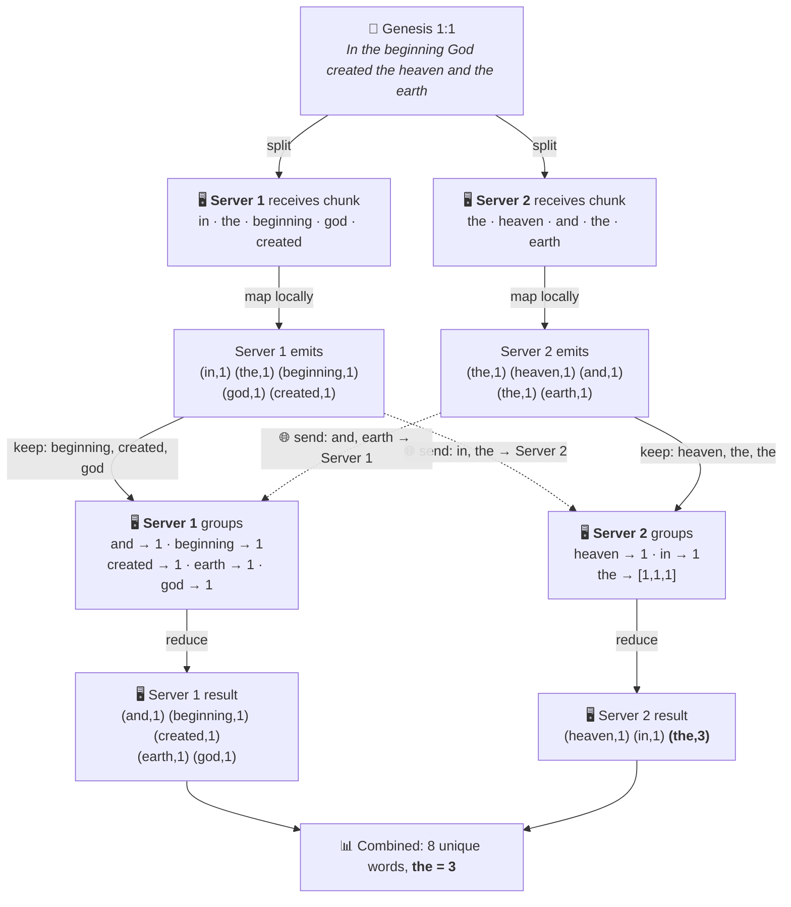

# Big Data & MapReduce — Why It Matters

> **Read time:** ~10 minutes. This page gives you the "why" and "how" of distributed data processing before you dive into SparkSQL.

---

## 1 — How Big Is "Big Data"?

Think about what Google handles **every single day**:

| Service | Scale |
|---|---|
| 🔍 Google Search | **8.5 billion** queries / day |
| ▶️ YouTube | **500 hours** of video uploaded every minute |
| 📧 Gmail | **1.8 billion** users; ~333 billion emails / day |
| 🗺️ Google Maps | **1 billion** km of directions served daily |


A single machine — no matter how powerful — **cannot** store, index, or process this volume of data. You need *hundreds or thousands* of machines working together. That is the core idea behind **distributed computing**.

### The Three Vs

Big data is often described by three dimensions:

- **Volume** — terabytes to petabytes (Google stores ~15 exabytes)
- **Velocity** — data arrives continuously in real time
- **Variety** — structured tables, raw text, images, logs, sensor readings, etc.

When any one of these exceeds what a single machine can handle, you need a **distributed processing framework**.

---

## 2 — Enter MapReduce

In 2004, Google published the [MapReduce paper](https://research.google/pubs/mapreduce-simplified-data-processing-on-large-clusters/) — one of the most influential papers in computer science. The idea is simple:

> **Break a huge job into tiny tasks, run them in parallel across many machines, then combine the results.**

MapReduce has two phases:

| Phase | What it does | Analogy |
|---|---|---|
| **Map** | Process each piece of data independently → emit `(key, value)` pairs | Each student highlights every word on their page |
| **Reduce** | Group by key, then combine values → produce final result | The teacher collects all highlights and counts each word |

Between Map and Reduce there is an automatic **Shuffle & Sort** step that groups all values with the same key together.

**Example: word count for Genesis 1:1** — *"In the beginning God created the heaven and the earth"*



> 🌐 **The dotted arrows are the key!** During shuffle, data crosses the network. Server 1 sends `(in,1)` and `(the,1)` to Server 2; Server 2 sends `(and,1)` and `(earth,1)` to Server 1. This is the most expensive step — and why MapReduce frameworks try to minimize it.

---

## 3 — MapReduce by Hand: Genesis 1:1-5

Let's trace through MapReduce with a real example. Here is the opening of Genesis (KJV):

> *In the beginning God created the heaven and the earth. And the earth was without form, and void; and darkness was upon the face of the deep. And the Spirit of God moved upon the face of the waters. And God said, Let there be light: and there was light. And God saw the light, that it was good: and God divided the light from the darkness.*

### Step 1 — Split

The framework splits the text into chunks that can be processed in parallel. Imagine two servers:

| Server | Text chunk |
|---|---|
| **🖥️ Server 1** | *In the beginning God created the heaven and the earth. And the earth was without form, and void; and darkness was upon the face of the deep.* |
| **🖥️ Server 2** | *And the Spirit of God moved upon the face of the waters. And God said, Let there be light: and there was light. And God saw the light, that it was good: and God divided the light from the darkness.* |

### Step 2 — Map

Each server reads its chunk word by word and emits `(word, 1)` for every word:

**🖥️ Server 1 emits:**
```
(in, 1)  (the, 1)  (beginning, 1)  (god, 1)  (created, 1)
(the, 1)  (heaven, 1)  (and, 1)  (the, 1)  (earth, 1)
(and, 1)  (the, 1)  (earth, 1)  (was, 1)  (without, 1)
(form, 1)  (and, 1)  (void, 1)  (and, 1)  (darkness, 1)
(was, 1)  (upon, 1)  (the, 1)  (face, 1)  (of, 1)
(the, 1)  (deep, 1)
```

**🖥️ Server 2 emits:**
```
(and, 1)  (the, 1)  (spirit, 1)  (of, 1)  (god, 1)
(moved, 1)  (upon, 1)  (the, 1)  (face, 1)  (of, 1)
(the, 1)  (waters, 1)  (and, 1)  (god, 1)  (said, 1)
(let, 1)  (there, 1)  (be, 1)  (light, 1)  (and, 1)
(there, 1)  (was, 1)  (light, 1)  (and, 1)  (god, 1)
(saw, 1)  (the, 1)  (light, 1)  (that, 1)  (it, 1)
(was, 1)  (good, 1)  (and, 1)  (god, 1)  (divided, 1)
(the, 1)  (light, 1)  (from, 1)  (the, 1)  (darkness, 1)
```

### Step 3 — Shuffle & Sort

The framework **automatically** collects all pairs with the same key across both servers:

```
and      → [1, 1, 1, 1, 1, 1, 1, 1, 1]   (9 occurrences)
the      → [1, 1, 1, 1, 1, 1, 1, 1, 1, 1, 1, 1]  (12 occurrences)
god      → [1, 1, 1, 1, 1]                (5 occurrences)
light    → [1, 1, 1, 1]                   (4 occurrences)
was      → [1, 1, 1, 1]                   (4 occurrences)
darkness → [1, 1]                          (2 occurrences)
face     → [1, 1]                          (2 occurrences)
upon     → [1, 1]                          (2 occurrences)
earth    → [1, 1]                          (2 occurrences)
of       → [1, 1, 1]                       (3 occurrences)
...and so on for every unique word
```

### Step 4 — Reduce

Each reducer sums its list of values:

```
(the, 12)  (and, 9)  (god, 5)  (light, 4)  (was, 4)
(of, 3)  (darkness, 2)  (earth, 2)  (face, 2)  (upon, 2)
(there, 2)  (beginning, 1)  (created, 1)  (heaven, 1)
(without, 1)  (form, 1)  (void, 1)  (deep, 1)  (spirit, 1)
(moved, 1)  (waters, 1)  (said, 1)  (let, 1)  (be, 1)
(saw, 1)  (that, 1)  (it, 1)  (good, 1)  (divided, 1)
(from, 1)  (in, 1)
```

**Final result:** "the" appears 12 times, "and" 9 times, "God" 5 times — just from these five verses.

> 💡 **Key insight:** Neither Server 1 nor Server 2 needed to see the *entire* text. Each worked on its own piece, and the framework handled the coordination. This is how Google processes billions of web pages.

---

## 4 — From MapReduce to Spark

Google's MapReduce was groundbreaking, but it had a limitation: **every step wrote to disk**. For iterative algorithms (like machine learning), this was painfully slow.

**Apache Spark** (2014) solved this by keeping data **in memory** between steps:

| Feature | Hadoop MapReduce | Apache Spark |
|---|---|---|
| Intermediate storage | Disk (HDFS) | Memory (RAM) |
| Speed | Baseline | **10–100× faster** |
| Programming model | Map + Reduce only | Map, filter, join, group, SQL, ML, graph… |
| Language support | Java | Python, Scala, Java, R, SQL |
| Interactive queries | No | Yes (SparkSQL!) |

This is why the rest of this module uses **SparkSQL** — it gives you the power of distributed processing with the convenience of SQL and Python.

---

## 5 — Try It Yourself

The MapReduce word count above is **exactly** what the in-class Spark notebook (`00 - InClassIntro.ipynb`) implements in code:

```python
# Read text → split into words → count
lines = sc.textFile("bookOfMormon.txt")
words = lines.flatMap(lambda line: line.lower().split())
wordCounts = words.map(lambda word: (word, 1)) \
                  .reduceByKey(lambda a, b: a + b) \
                  .sortBy(lambda t: t[1], False)
wordCounts.take(10)
```

Notice the **same four steps**:
1. **Split** — `textFile` loads and partitions the data
2. **Map** — `flatMap` extracts words, `.map` emits `(word, 1)`
3. **Shuffle** — `reduceByKey` groups by word (automatic)
4. **Reduce** — the lambda `a + b` sums the counts

> **Next:** Open `00 - InClassIntro.ipynb` in [Google Colab](https://colab.research.google.com/) and run it to see this in action.